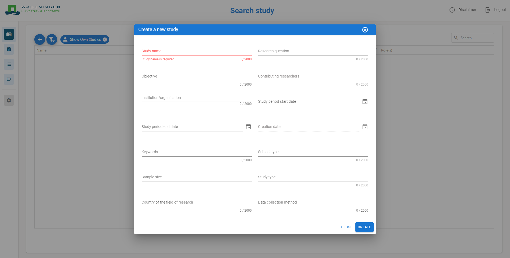
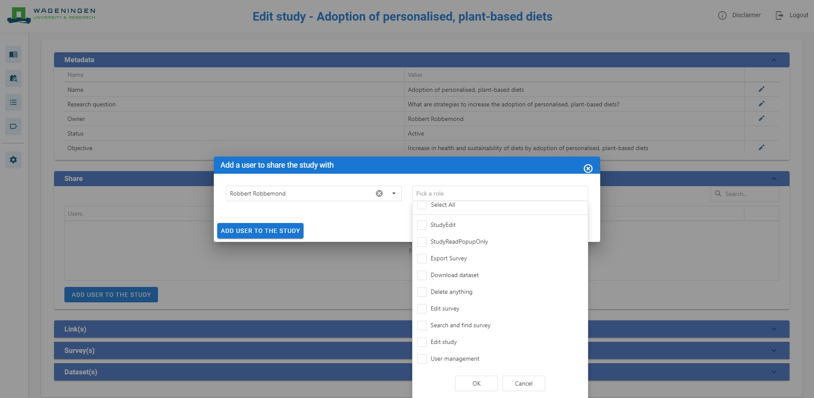
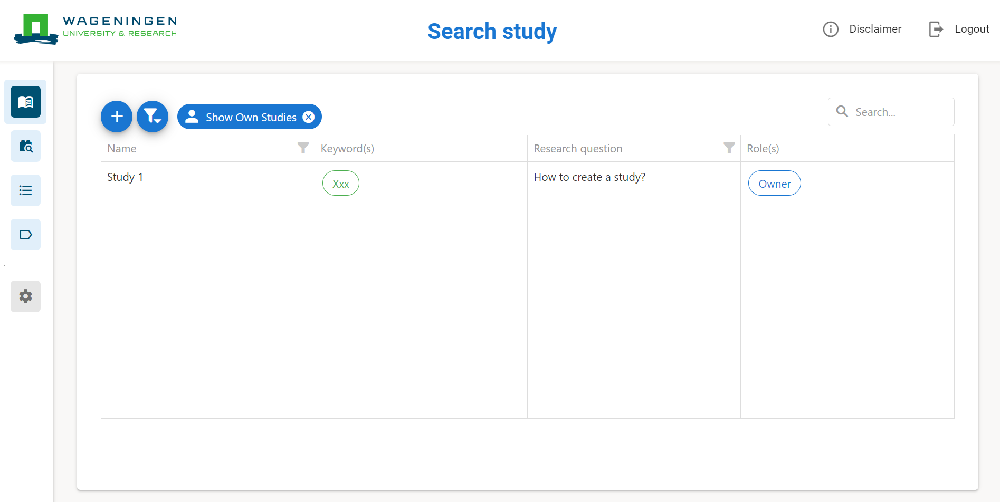

# Create Study

In this section, a step-by-step guide is provided for users to create their own study. This section is divided into three parts: study metadata, study sharing details, and study access details.

## Provide study metadata

A study is a research activity designed to answer a specific research question through the systematic collection of data using a defined methodology within a defined temporal and organisational context. Providing a study’s metadata, ensures its shareability and flexibility. Hence, a study is easy to understand, recognize, and find when searched by other users. This is in line with the FAIR data principles.

Every new study requires metadata for findability. A study’s metadata includes all the necessary details about the study such as study duration, research question, study type, and objective. To create a new study, click the plus icon ‘+’ on the left. A dialog will appear that enables you to enter the required metadata. Please complete only the fields that are relevant for your study. Upon completion, the user is automatically assigned the role of study owner.

For the ReGeNL project, this section is currently under development. In future releases, study registration will be more closely aligned with pre-registration platforms and is expected to support linking to a pre-registration platform identifier.

## Provide study sharing details

Providing study sharing details determines the study’s accessibility settings. It is essential to ensure the safety and privacy of research data when setting up a study in accordance with the FAIR principles. The EQT approach ensures that a study is as open as possible and as closed as necessary. Only the study owner can configure the sharing settings of a study.

Once a study has been created, the metadata, share, link(s), survey(s), and dataset(s) header sections of the study become available. The metadata section is described in subsection 3.1. The share section displays all the study’s sharing details (see upper arrow, Figure 3). This allows the study owner to manage access rights (i.e., who can view or edit the study and its contents). Only study owners can add users to a study through the designated button (see lower arrow, Figure 3) as well as edit or remove current users. Roles of study users are managed by the study owner. Study users can view the sharing details but cannot manage them. The available roles are listed below.

## Study roles and their functions

| Study role | Function |
|---|---|
| StudyEdit | Provides a user with permission to access and edit a study and its contents |
| StudyReadPopUpOnly | Provides a user with permission to only read the study descriptive data |
| Export Survey | Provides a user with permission to export survey(s) |
| Download dataset | Provides a user with permission to download dataset(s) |
| Delete anything | Provides a user with permission to delete any information |
| Edit survey | Provides a user with permission to edit survey(s) |
| Search and find survey | Provides a user with permission to search for and find specific survey(s) |
| Edit study | Provides a user with permission to edit the contents of a study |

## Select user and role for study

The ‘Link(s)’ section under the ‘Share’ header is where the study owner and users can add relevant URLs for quick access (e.g., project websites or published articles).

The ‘Survey(s)’ section lists all surveys that are part of the study. A new survey can be added by the study owner and users using the designated button.

The ‘Dataset(s)’ section, all the study’s datasets are available. A new dataset can be uploaded using the ‘upload dataset’ button.

All sections can also be accessed and edited via the ‘Search Study’ page. For quick access to a study, use the book icon ‘’ in the navigation bar on the left. Clicking on a study opens a pop-up window displaying an overview of the study. Please note that the pop-up window will only show the contributing user in the study. To view user permissions and additional details, click the pencil icon ‘’ on the left corner to edit the study (i.e., access to the sections). A study can be deleted by the study owner and/or user(s) assigned role ‘delete anything’ using the bin icon ‘’. Communication is facilitated via the mail icon ‘’ which allows users to send an email directly to the study owner.

If a user selects a study to which they do not have access, only the mail icon will be visible, as the researcher does not have permission to view or interact with the study’s content.

## Find study and access details

Part three focuses on the findability and accessibility of studies. Providing accurate and complete study metadata is essential for this functionality to operate effectively and supports responsible research in line with the FAIR data principles. The Study page (see arrow, Figure 4) is used to search for and access studies. The following functions are available:

Use the funnel icon ‘’ at the top to filter the study list. Available filters include: your own studies, shared studies, and closed studies.

Click on a study to open a pop-up view with its metadata details.

In the header row of the study table, use the funnel icon ‘’ next to the Research question column to apply column-specific filters.

Use the search bar to locate studies based on their metadata.

Accurate metadata enables these search and filtering functions to operate effectively.

## Search study page

