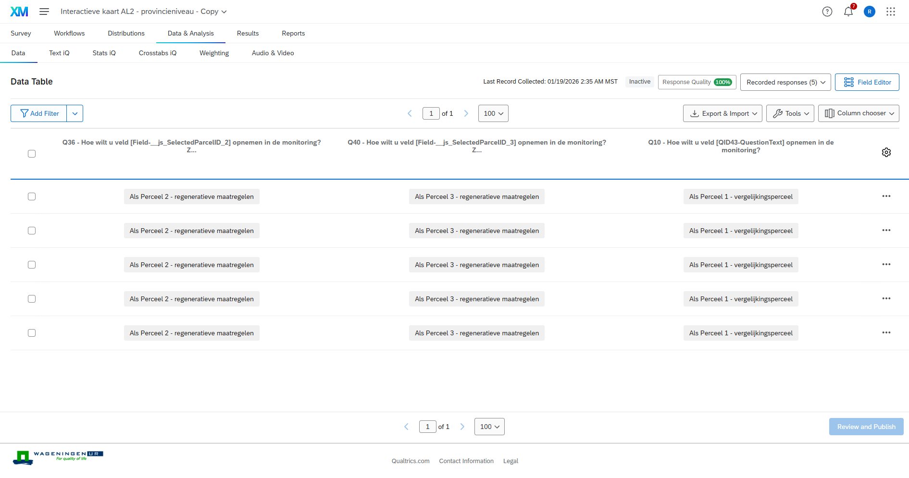
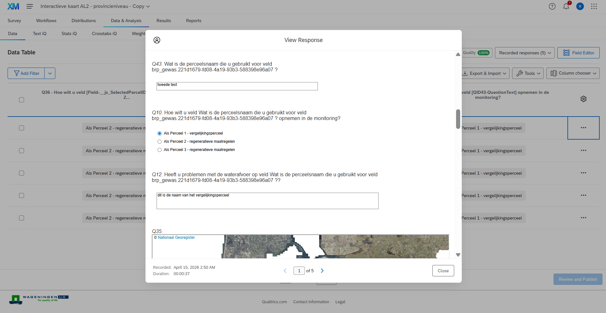

# Data collection

The data collection process can start after the desired distribution method is selected. Surveys can be sent online via links to the relevant contacts, or they can be filled in face-to-face by an interviewer that is present with the contact (e.g., a farmer at their farm). For an organized data collection process, it is advised to use the exported CSV file with all the contacts and their specific corresponding links.

Once the data is collected through Qualtrics, it can be reviewed under the ‘Data & Analysis’ header. In case there is a wrongly inputted response (e.g., mistake in an open question), it can be edited in the Data Table.

## Data Table in Qualtrics

Click on the More option ‘…’ to view and edit the incorrect response(s).

## Edit responses in Data Table

Lastly, survey data can be exported to the user’s computer. Using the ‘Export & Import’ button (see arrow, Figure 26), the data can be downloaded in any of the format listed.

## Export Data from Qualtrics

Please note, before Step 8 in the [Workflow](https://teamwalabi.github.io/EQTManual/process-overview), the action line coordinator and users involved in the study need to ensure that the data is cleaned and corrected before uploading the data onto Adagio.