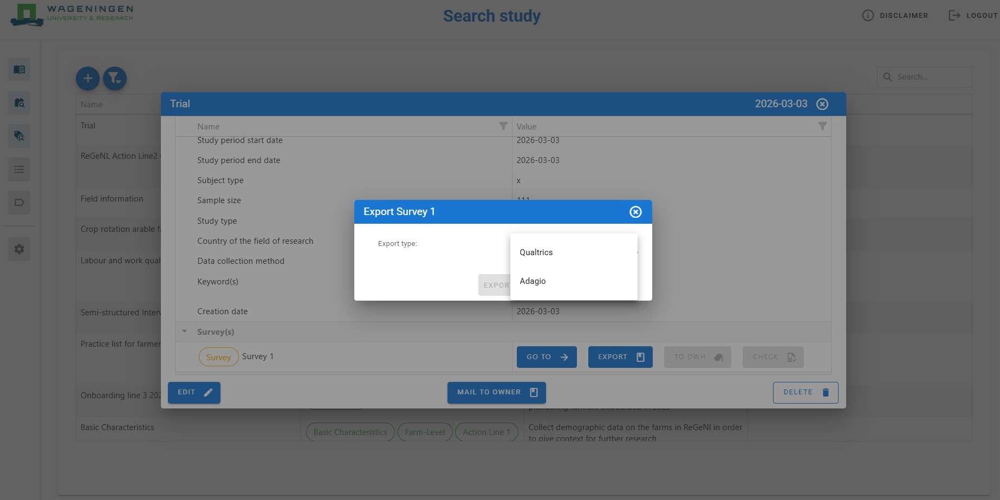

# Export survey

To export a survey, the user needs to be either the study owner or assigned the export survey role. For exporting a survey use the study’s quick access pop-up box on the ‘Search study’ page.

## Study quick access export

There are two export types: Qualtrics (QSF file) and Adagio. The QSF file can be imported to Qualtrics where the user can make the final adjustments to the look and feel of the survey, distribute, and launch the survey. The user must have a private or university-associated account to be able to use Qualtrics.

## Survey export types

