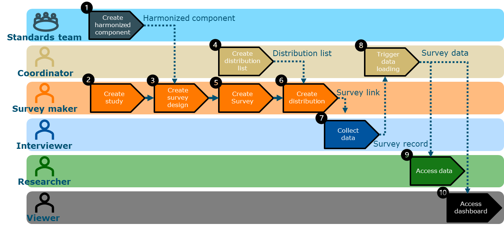

# Easy Questionnaire Tool (EQT)

Welcome to the Easy Questionnaire Tool (EQT) documentation.

EQT supports researchers in creating, harmonising, distributing, and managing surveys for agricultural and interdisciplinary research projects. The platform is designed to support FAIR data principles and collaborative research workflows.

---

## What you can do with EQT

Using EQT, researchers can:

- Create and manage studies
- Build survey designs
- Reuse harmonised survey components
- Export surveys to Qualtrics
- Manage survey distribution
- Collect and process data consistently

---

## Workflow Overview

*Figure 1. EQT workflow overview*

---

## Quick Start

New users typically follow these steps:

1. Request access to EQT
2. Create a study
3. Create a survey design
4. Add harmonised components
5. Export the survey to Qualtrics
6. Distribute the survey
7. Collect and analyse data

---

