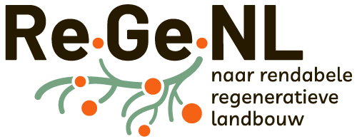
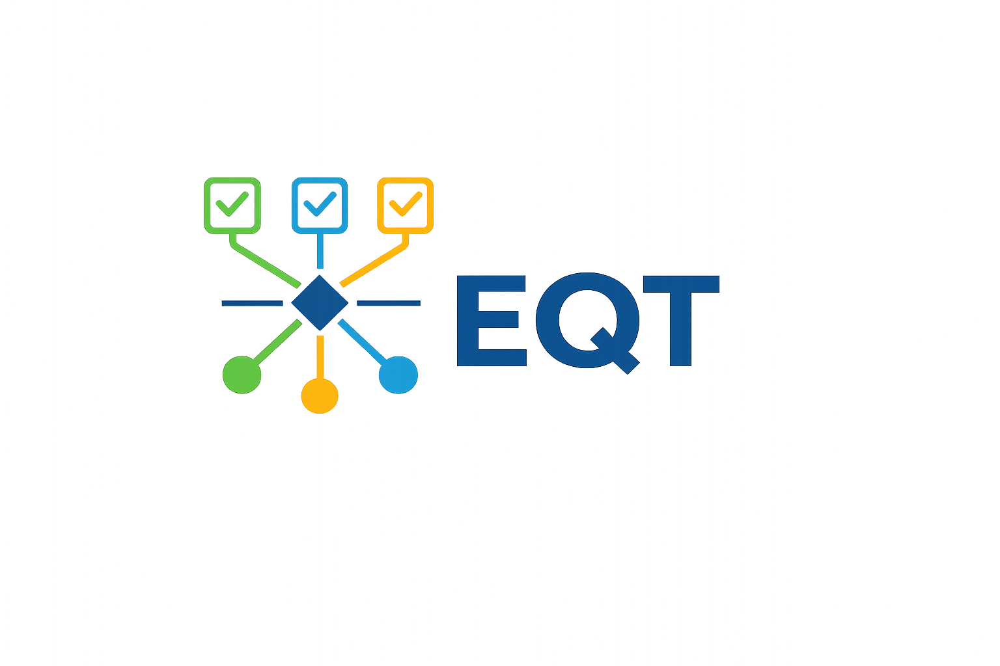

# Introduction

The Easy Questionnaire Tool (EQT) supports researchers in creating, harmonising, distributing, and managing surveys for agricultural and interdisciplinary research projects.

EQT helps researchers:
- Create studies and surveys
- Reuse harmonised survey components
- Export surveys to Qualtrics
- Organise structured data collection
- Support FAIR data principles

The tool is used within the ReGeNL programme, which focuses on regenerative agriculture and sustainable farming innovation in the Netherlands.

The EQT tool and the manual are developed with the support of the Wageningen Lab for Business Informatics.

## Quick Links

## FAIR Data Principles

EQT supports FAIR research data management:

- **Findable**
- **Accessible**
- **Interoperable**
- **Reusable**

This helps researchers create reusable and harmonised datasets across studies and projects.