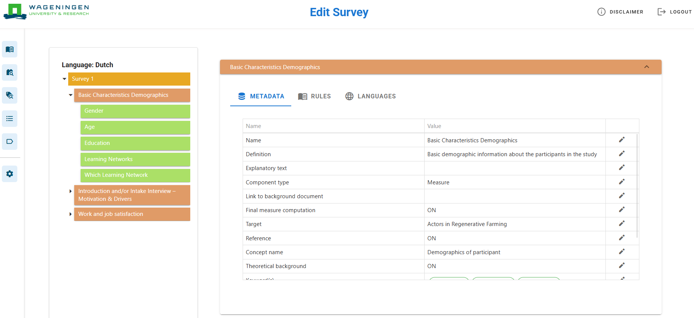

# 2. Process Overview

## 2.1. Workflow

**Figure 1. Workflow**

The process in the EQT consists of ten steps (Figure 1). The manual covers the first seven steps; the rest of the steps are out of scope. In the first step, the team of researchers make harmonised components available (1). Next, the user will create a study (2) and a survey design (3). The coordinator is responsible for creating the distribution list (4). The distribution list contains a list of individuals to whom the survey can be distributed. After which, the user will create the survey on Qualtrics (5) and use the list to create a distribution with survey links (6). The data is then collected and recorded by the interviewer (7). In step 8, the data from Qualtrics is loaded on Adagio, manually or automatically. One of the advantages of using the EQT is having the model automatically generated in Adagio. The actual data loading is out of scope for this manual. Lastly, the survey data can be accessed by the researcher (9) and is available for viewing on the dashboard (10).

