# Create Survey Design

To start the data collection phase, a survey design must be created. The survey design serves as the link between data collection process and data storage. It defines the look, feel, and flow of the survey presented to respondents, while also specifying how the collected data is structured and mapped to the underlying data model. This ensures a consistent and well-organized data collection method.

## Add new survey to study

A study can contain one or more surveys. New or additional surveys can be added to a study and configured using both custom elements and harmonised components.

Surveys are managed within the ‘Survey(s)’ section of a study. In this section users can:

- [Add a new survey](https://rmrobbemond-dotcom.github.io/EQTManual/survey-design.html#add-new-survey)
- Open an existing survey using the arrow icon ‘➜’
- Manage access permissions using the person icon ‘👤’
- Delete a survey using the bin icon ‘🗑’.

When a user creates a new survey), they automatically are assigned the role of survey owner and can manage access permissions thereafter.

## Add new survey

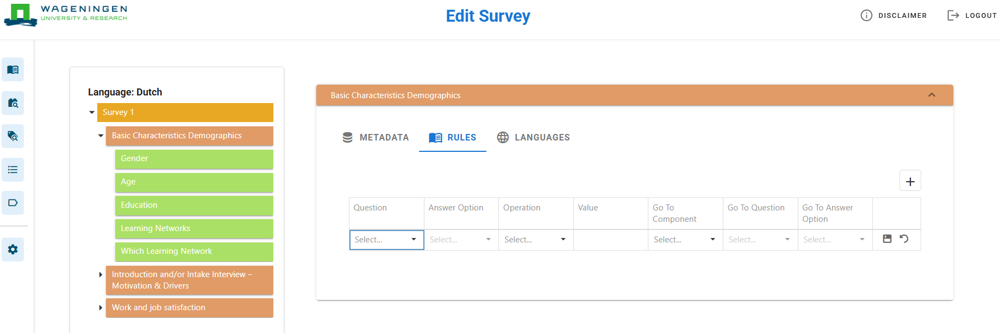

Upon clicking ‘Add new survey’, the library of harmonised components opens. The library contains all available harmonised components that can be used to build a survey.

A component is a standardized measure used to capture a specific concept in a consistent way across surveys. Each component consists of one or more questions. Questions may be of different types, each with its own configuration and structure, including how it relates to statements and/or response options.

Components are organized hierarchically into concepts and categories. A concept is an abstract construct representing a characteristic, attribute, or phenomenon that a study aims to measure. A category groups together related concepts.

Multiple components may exist for the same concept when there are different valid ways to measure it. For example, the component “Wildlife protection” belongs to the concept “Land management”, which is part of the category “Farm socio-economic management”. A category can contain multiple concepts, and a concept can contain multiple components.

Keywords are used to support quick searching and identification of components within the library. For quick access to the harmonised protocol search, use the binocular icon in the navigation bar.

## Harmonised protocol search page

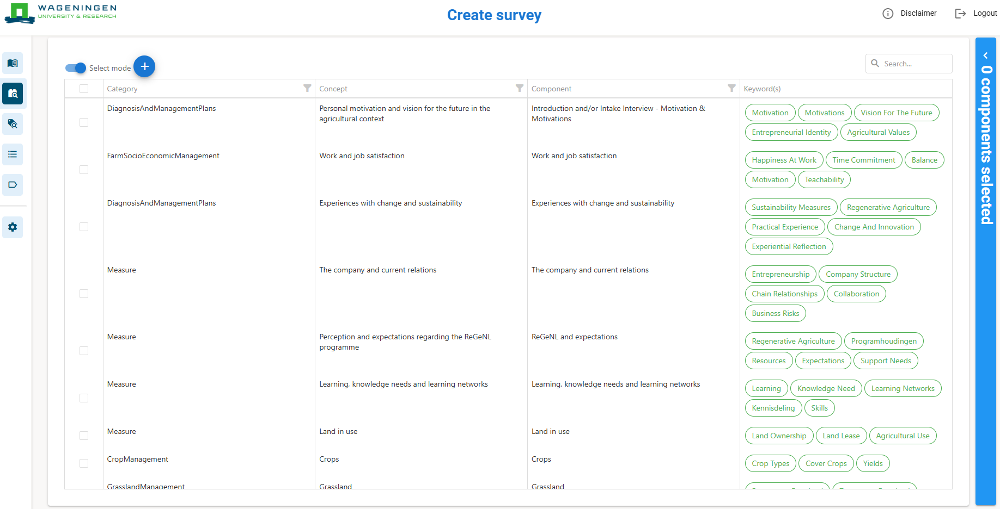

There are two modes available in the harmonised protocol search library: search (i) and create (ii) (see arrow, Figure 7).

To browse available components before selecting them for a survey, use the ‘Search’ mode.

To select and add components to compose a survey, use the ‘Create’ mode. This mode also provides an alternative way to create or add a new survey (see subsection 4.1).

## Datagrid mode selection

In the ‘Search’ mode, clicking on a desired component opens a pop-up window displaying the component’s metadata. This includes the languages available, links to background documents, and other metadata (Figure 8).

## Metadata of component

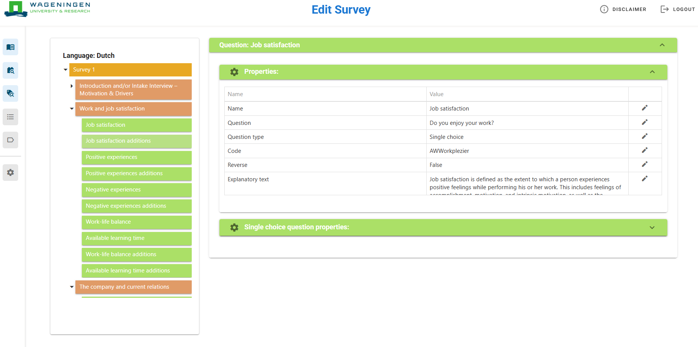

Periodically, new harmonised components are added to the harmonised protocol search. New harmonised components are added to the library on a regular basis. The library provides an overview of available components and their structure. The metadata associated with each component can be used to assess its relevance and suitability for inclusion in a survey.

## Select relevant harmonised components

To make a component selection, the data grid mode must be switched to ‘Create’.

The first step to create a survey is selecting relevant harmonised components using the check box next to each component. Selected components are displayed in the right-hand column. This allows users to switch efficiently between Search and Create modes without losing their selections.

Once all desired components have been selected, click the ‘Create’ survey button. A dialog will appear prompting you to enter the required survey details (Figure 9).

Provide the following information:

Survey language(s) (required)

Survey name

Selected study (verify that the correct study is selected)

After completing these fields, click ‘Create’ to generate the survey.

Please note that the ‘Create’ button will only become available after at least one survey language has been selected.

## Create survey

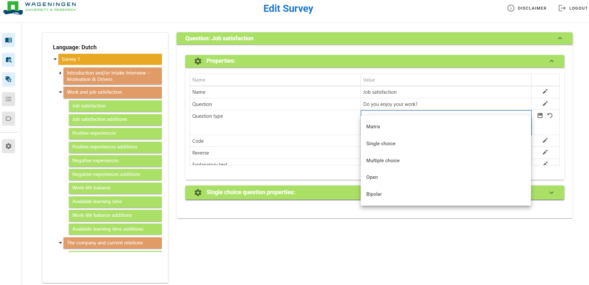

## Edit survey content

Survey content can be configured to meet the requirements of a specific study. This subsection describes how to view, edit, and extend survey content.

## Survey characteristics

Before editing the survey structure, the key elements of a survey are defined below.

## Description of survey characteristics
| Survey characteristic | Description |
|---|---|
| `(Harmonised) Component` | A standardized measure representing a concept. A component may consist of multiple questions/items. Harmonised components are assigned a predefined code for identification during analysis. |
| `Question/item` | A question or statement used to measure a component. It may be standalone or part of a set. Each item typically has a short label. |
| `Classification (i.e., answer option)` | The response format of a question/item (e.g., yes/no, multiple choice, open text, scale). |

## Survey content

When a harmonised component is added to a survey, its structure including groupings, questions/items, question types, and classifications is preconfigured. These elements can be adjusted as needed (Figure 10).

To edit survey content:

Click on a component name in the survey design tree (1).

Use the pencil icon (2) to edit component metadata.

## Harmonised components in survey

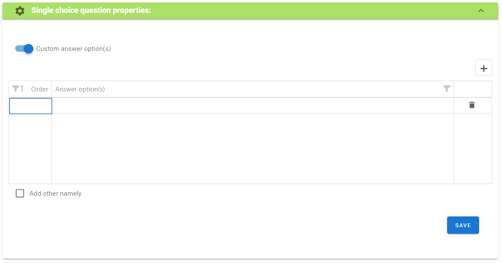

Rules (logic and routing)

Rules define the flow of the survey based on responses. To configure rules:

Click the Rules button (3).

Click the plus icon ‘’ to add a rule (Figure 11).

Select a question and define:

Answer option(s)

Value

Operator (e.g., equals, not equals, greater than)

Next step (component, question, or endpoint)

Save the rule using the save icon ‘’ or cancel ‘’ to discard changes. Multiple rules can be defined per component.

## Rules of component in survey

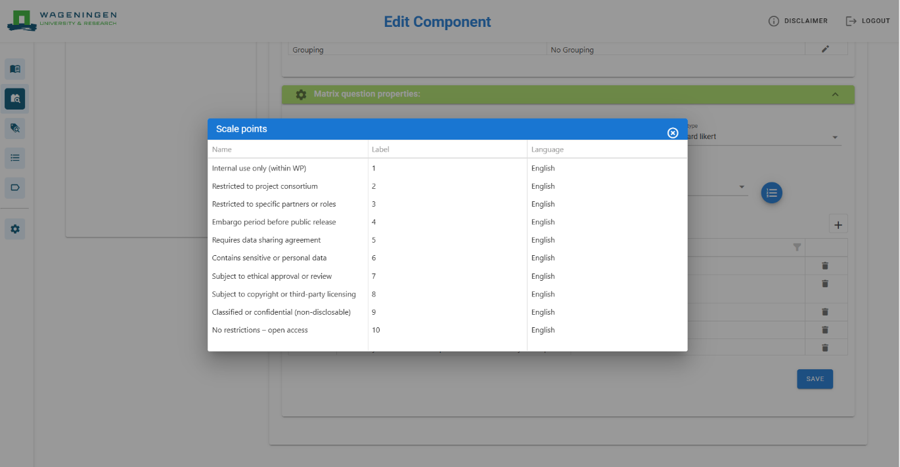

Languages and translation

Harmonised components are currently available in English and Dutch. Additional translations can be entered manually per survey. These translations apply only to the current survey and are not stored globally. Shared surveys retain the entered translations for collaborating users.

## Harmonised component

Each component contains one or more questions/items. Each question has configurable properties. The ‘Properties’ table includes:

- Question text
- Question type
- Code
- Reversibility
- Explanatory text
- Grouping

All properties can be edited using the ‘’ pencil icon.

## Question properties of harmonised component

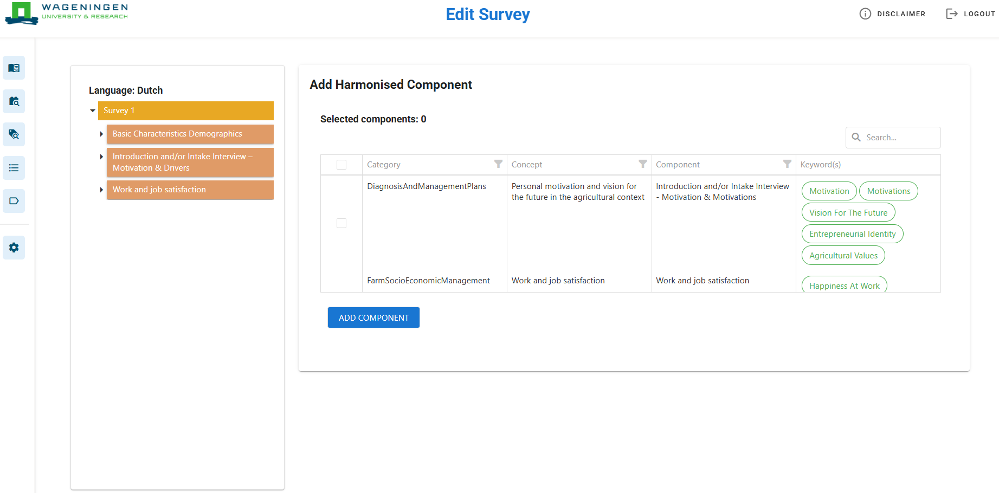

Key elements

The following elements determine how questions are represented in the survey and referenced during data analysis.

A code/unique identifier (e.g., AWWorkplezier) used for analysis and data tracking.

Question type defines how a question and its response options are presented. The available options are (Figure 13):

Single choice

Multiple choice

Open

Bipolar

Matrix

These types correspond to the answer options for the question. Each question in a harmonised component has its question types preassigned to facilitate this process for the user. Based on the selected question type, the properties table will be adjusted.

## Question types

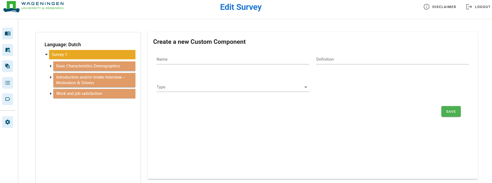

Question types explained

The following question types determine the structure of questions and the format of their response options within the survey.

Single choice

Respondents select one option from a predefined list. Classifications (e.g., scales) are preassigned but can be changed via the list icon.

Multiple choice

Respondents can select more than one answer option.

Open

Respondents provide a free-text response.

Bipolar

Respondents choose between two opposing options.

Matrix

Respondents evaluate multiple items using a shared set of answer options.

Custom answer options can be defined by switching to custom answer options. The option “Add other, namely” enables open input (Figure 14).

Matrix configuration

For matrix questions, the Matrix properties table defines:

Items (rows)

Answer scale (columns)

Classification

Each item has a label and language setting. Items can be:

Added (plus icon ‘’)

Reordered (order column)

Deleted (bin icon ‘’)

## Classification scale points

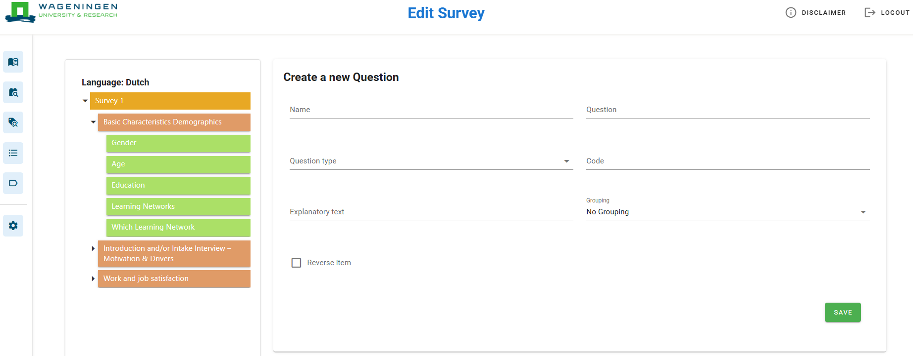

## Add (harmonised) component

After initial creation of a survey, harmonised components can still be added by right-clicking on the bar displaying the name of the survey (header of the survey design tree) and selecting ‘Add harmonised component’ or ‘Add component’.

Add harmonized component

Select from the library of categories, concepts, and components. Multiple components can be selected simultaneously (Figure 16).

## Add harmonised component in survey

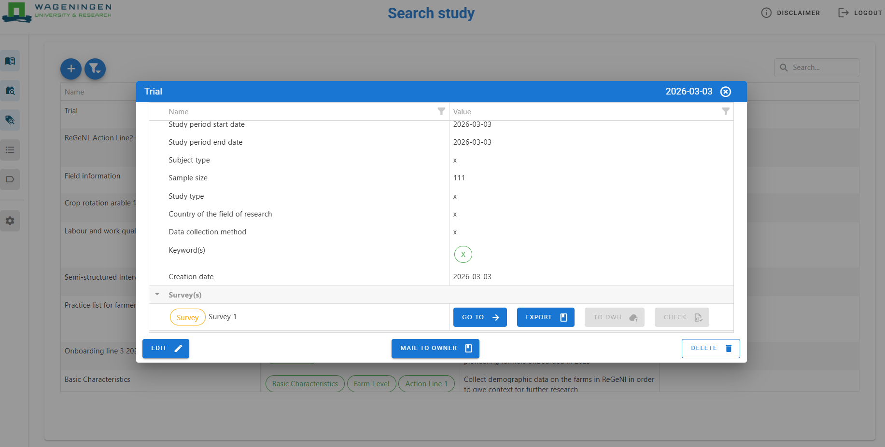

Add custom component

Create a new component if no suitable harmonised component exists (Figure 17). Required fields: Name, definition, and category.

## Create a new custom component in survey

Edit component options

Right-click a component to:

Add a question/item

Delete the component

Copy the component

Add question

To create a new question (Figure 18), specify:

Name

Question text

Question type

Code

Explanatory text

Grouping (optional)

Questions and components can also be deleted via right-click.

## Create new question in survey

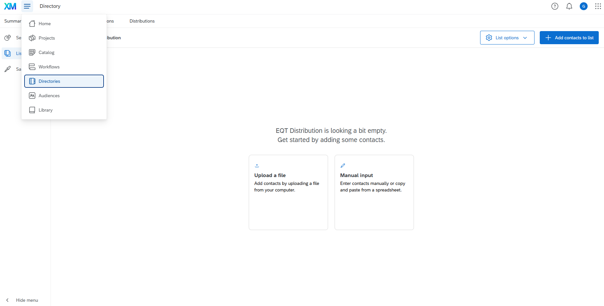

